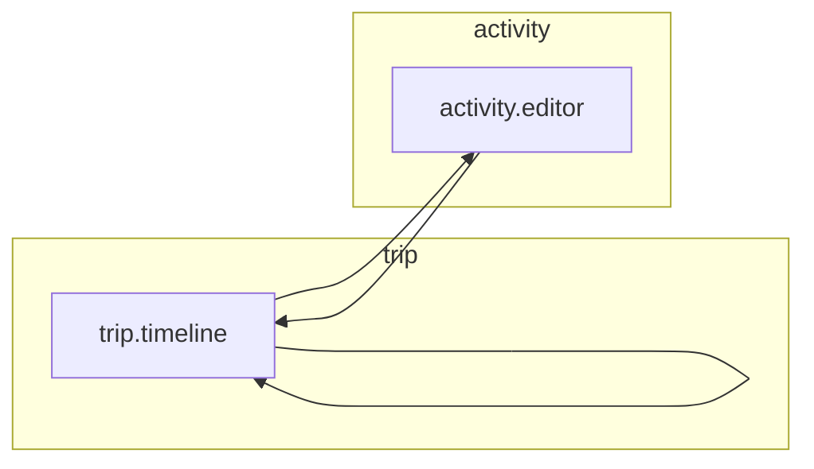

<!-- Generated by starboard. Do not edit. -->

# App map

```mermaid
flowchart LR
  subgraph area1["trip"]
    trip_timeline["trip.timeline"]
  end
  subgraph area2["activity"]
    activity_editor["activity.editor"]
  end
  activity_editor --> trip_timeline
  trip_timeline --> activity_editor
  trip_timeline --> trip_timeline
```
